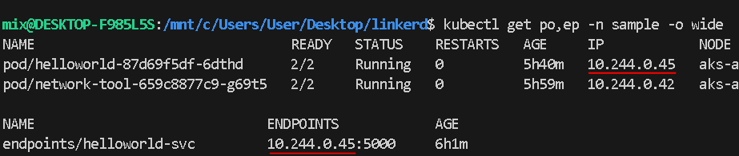

# Usage
This repository is designed to help you to create a connection between two kubernetes cluster and help you to split traffic base on propotion with failover cluster 

### Before you begin
You need 2 kubernetes cluster avaiable on any cloud platform

## Install step for generate cert and key
You can check out the documentation how to install this
<a href="https://smallstep.com/docs/step-ca/installation/#macos" target="_blank">link</a>

### Prepare folder for cert
    mkdir certs
    cd certs

### Generate certificates

    step certificate create root.linkerd.cluster.local root.crt root.key \
    --profile root-ca --no-password --insecure

### Generate the issuer credentials using the trust anchor

    step certificate create identity.linkerd.cluster.local issuer.crt issuer.key \
    --profile intermediate-ca --not-after 8760h --no-password --insecure \
    --ca root.crt --ca-key root.key

    cd ..

### Install linkerd on your machine
Also you can checkout docs how to install <a href="https://linkerd.io/2.13/getting-started/" target="_blank">link</a> or following me

    curl --proto '=https' --tlsv1.2 -sSfL https://run.linkerd.io/install | sh
    # There will be command that you need to follow after install

### Install Linkerd on both cluster

    linkerd install --crds \
    | tee \
        >(kubectl --context=test1 apply -f -) \
        >(kubectl --context=test2 apply -f -)

### Install control plane on both cluster

    linkerd install \
        --identity-trust-anchors-file certs/root.crt \
        --identity-issuer-certificate-file certs/issuer.crt \
        --identity-issuer-key-file certs/issuer.key \
        | tee \
            >(kubectl --context=test1 apply -f -) \
            >(kubectl --context=test2 apply -f -)

### Install Viz on both cluster

    for ctx in test1 test2; do
    linkerd --context=${ctx} viz install | \
        kubectl --context=${ctx} apply -f - || break
    done

### Verify that install is complete

    for ctx in test1 test2; do
        echo "Checking cluster: ${ctx} ........."
        linkerd --context=${ctx} check || break
        echo "-------------"
    done

### Install multicluster on both cluster
    for ctx in test1 test2; do
        echo "Installing on cluster: ${ctx} ........."
        linkerd --context=${ctx} multicluster install | \
            kubectl --context=${ctx} apply -f - || break
        echo "-------------"
    done

### Verify gateway on both cluster
    for ctx in test1 test2; do
        echo "Checking gateway on cluster: ${ctx} ........."
        kubectl --context=${ctx} -n linkerd-multicluster \
            rollout status deploy/linkerd-gateway || break
        echo "-------------"
    done

### Link test1 to test2
    linkerd --context=test2 multicluster link --cluster-name test2 |
    kubectl --context=test1 apply -f -

### Check that mirror has generated and can reach test2 
    linkerd --context=test1 multicluster check

### Check muticluster gateway
    linkerd --context=test1 multicluster gateways

## Next part you need to have helm install on your machine
If helm is not exist on your machine check this link  <a href="https://helm.sh/docs/intro/install/" target="_blank">link</a>

### Install linkerd-smi and Failover extension in Primary Cluster
    helm --kube-context=test1 repo add linkerd-smi https://linkerd.github.io/linkerd-smi
    helm --kube-context=test1 repo up
    helm --kube-context=test1 install linkerd-smi -n linkerd-smi --create-namespace linkerd-smi/linkerd-smi

    helm --kube-context=test1 repo add linkerd-edge https://helm.linkerd.io/edge
    helm --kube-context=test1 repo up
    helm --kube-context=test1 install linkerd-failover -n linkerd-failover --create-namespace --devel linkerd-edge/linkerd-failover

### Injecting our test api on both cluster
    linkerd --context=test1 inject hello-v1.yaml | kubectl --context=test1 apply -f -
    linkerd --context=test2 inject hello-v2.yaml | kubectl --context=test2 apply -f -

### If you don't have the namespace sample in both cluster you need to create first
    kubectl create namespace sample --context=test1
    kubectl create namespace sample --context=test2

### You can check the endpoint and pods
#### You need to check the endpoint and the ip need to be match
    kubectl get po,ep -n sample -o wide

### Mirror the secondary cluster to primary cluster
    kubectl --context=test2 -n sample label svc/helloworld-svc mirror.linkerd.io/exported=true
    kubectl --context=test1 -n sample get svc

### Apply the Failover TrafficSplit
    kubectl --context=test1 apply -f weight.yaml

### To Test the result you need to install network-tool on both cluster
    kubectl create deploy network-tool --image wbitt/network-multitool --context=test1 -n sample
    kubectl create deploy network-tool --image wbitt/network-multitool --context=test2 -n sample

### Running test on test1 cluster (Need to open terminal) (Reponse must be split) 
    kubectl get pods -n sample --context=test1

    # You will get something like this copy network name
    NAME                                 READY   STATUS    RESTARTS   AGE
    helloworld-87d69f5df-cjt5m           2/2     Running   0          5h6m
    network-tool-659c8877c9-z8lcl <---   2/2     Running   0          5h27m

    kubectl exec -it --context=test1 -c network-multitool -n sample network-tool-659c8877c9-z8lcl /bin/bash
    
    
    while true; 
    do 
    curl helloworld-svc.sample.svc.cluster.local:5000; 
    sleep 2s; 
    done;

### Running test on test2 cluster (Need to open terminal) (Reponse must be only msg:hello2)
    kubectl get pods -n sample --context=test2

    # You will get something like this copy network name
    NAME                                 READY   STATUS    RESTARTS   AGE
    helloworld-87d69f5df-cjt5m           2/2     Running   0          5h6m
    network-tool-659c8877c9-z8lcl <---   2/2     Running   0          5h27m

    
    kubectl exec -it --context=test2 -c network-multitool -n sample network-tool-659c8877c9-z8lcl /bin/bash
    
    
    while true; 
    do 
    curl helloworld-svc.sample.svc.cluster.local:5000; 
    sleep 2s; 
    done;

### Result In terminal test1 cluster
Result choose be scale on 50/50

### Check Traffic (Need to open terminal)
    linkerd --context=test1 viz stat -n sample svc --from deploy/network-tool

#### You choose get some reponse like this
    NAME                   MESHED   SUCCESS      RPS   LATENCY_P50   LATENCY_P95   LATENCY_P99   TCP_CONN
    helloworld-svc              -   100.00%   0.3rps           1ms           1ms           1ms          1
    helloworld-svc-test2        -   100.00%   0.2rps           2ms           2ms           2ms          1

### Testing Weight 
#### You need to change the weight in weight.yaml and apply by 
    
    ### Change weight
    apiVersion: split.smi-spec.io/v1alpha2
    kind: TrafficSplit
    metadata:
        name: helloworld-svc-failover
        namespace: sample
    spec:
        service: helloworld-svc
        backends:
            - service: helloworld-svc
            weight: 100
            - service: helloworld-svc-test2
            weight: 0
        
    ### Command
    kubectl replace --force -f weight.yaml
You should see only {msg:hello1} in the terminal context=test1

### Let Test the failover

Change weight back to 50 50
        - service: helloworld-svc
        weight: 50
        - service: helloworld-svc-test2
        weight: 50

So right now the traffic is split in half If we will try to shutdown the cluster1 by making replicas to 0 that mean the service in cluster1 is down
    
    kubectl --context=test1 scale deploy helloworld -n sample --replicas=0

Go back to the terminal in context=test1 that you running the network tool you will see that from the previous response you will get response that is being split between cluster1 and cluster2 but after clsuter1 is down you will get only response from cluster2 

    Example
    ### Before cluster1 down (traffic split)
    {"msg":"hello1"}{"msg":"hello2"}{"msg":"hello1"}{"msg":"hello2"}{"msg":"hello1"}{"msg":"hello1"}

    ### When we make replicas cluster1 to 0 only cluster 2 is avaiable
    {"msg":"hello2"}{"msg":"hello2"}{"msg":"hello2"}{"msg":"hello2"}{"msg":"hello2"}{"msg":"hello2"}

## Noted
### You can also check the dashboard by running this following command
    linkerd viz dashboard

### If you getting weird error you can reinstall viz
following this <a href="https://linkerd.io/2.13/tasks/uninstall/#" target="_blank">link</a>
